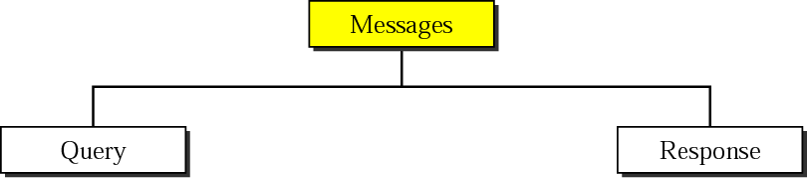
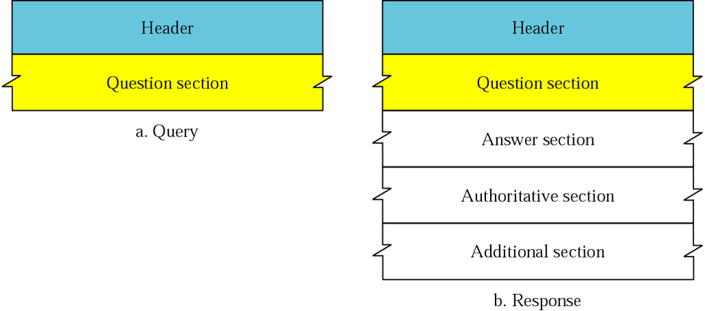

# 1. Giới thiệu về DNS

____

# Mục lục

- [1.1 DNS là gì?](#what-is)
- [1.2 Vai trò, chức năng của DNS](#feature)
- [1.3 Tại sao lại cần DNS Server](#why)
- [1.4 Thế nào là DNS Record, một số loại record phổ biến?](#dns-record)
    - [1.4.1 Bản ghi loại A](#dns-record-A)
    - [1.4.2 Bản ghi loại AAAA](#dns-record-AAAA)
    - [1.4.3 Bản ghi loại NS](#dns-record-NS)
    - [1.4.4 Bản ghi loại CNAME](#dns-record-CNAME)
    - [1.4.5 Bản ghi loại HINFO](#dns-record-HINFO)
    - [1.4.6 Bản ghi loại SOA](#dns-record-SOA)
    - [1.4.7 Bản ghi loại PTR](#dns-record-PTR)
    - [1.4.8 Bản ghi loại MX](#dns-record-MX)
- [1.5 DNS Messages](#dns-mesg)
- [Các nội dung khác](#content-others)

____

# <a name="content">Nội dung</a>

- ### <a name="what-is">1.1 DNS là gì?</a>

    - DNS là cụm từ viết tắt của `Domain Name System`. DNS là một hệ thống quan trọng cho Internet ngày nay. Việc thiết lập hồ sơ DNS không chính xác gây ra nhiều sự cố khác nhau cho quản trị viên của máy chủ web và cơ sở hạ tầng của công ty.

    - Trong DNS, ta cần chú ý về:

        + `Name Space`: Tên được gán cho máy phải là duy nhất vì địa chỉ là duy nhất. Một không gian tên mà mapping với mỗi địa chỉ phải là một tên duy nhất và có thể được tổ chức theo hai cách: cùng cấp hoặc theo cấp bậc.

        - `Domain Name Space` có thứ bậc trong thiết kế. Tên được định nghĩa trong một cấu trúc cây ngược với gốc ở trên cùng. Cây có thể có 128 cấp độ: cấp 0 (gốc) đến cấp 127

            > 

- ### <a name="whyfeature">1.2 Vai trò, chức năng của DNS</a>

    - Chức năng của DNS về căn bản là một hệ thống giúp cho việc chuyển đổi các tên miền mà con người dễ ghi nhớ (dạng ký tự, ví dụ www.google.com) sang địa chỉ IP vật lý (dạng số, ví dụ 123.11.5.19) tương ứng của tên miền đó. DNS giúp liên kết với các trang thiết bị mạng cho các mục đích định vị và địa chỉ hóa các thiết bị trên Internet.

    - Khi mở một trình duyệt Web và nhập tên website, trình duyệt sẽ đến thẳng website mà không cần phải thông qua việc nhập địa chỉ IP của trang web. Quá trình "dịch" tên miền thành địa chỉ IP để cho trình duyệt hiểu và truy cập được vào website là công việc của một DNS server. Các DNS trợ giúp qua lại với nhau để dịch địa chỉ "IP" thành "tên" và ngược lại. Người sử dụng chỉ cần nhớ "tên", không cần phải nhớ địa chỉ IP (địa chỉ IP là những con số rất khó nhớ).

- ### <a name="">1.3 Tại sao lại cần DNS Server</a>

    - Các doanh nghiệp lớn sử dụng domain để dễ dàng quản lý các máy trạm của nhân viên trong doanh nghiệp. DNS server được dựng lên để phân giải những domain đó. Các doanh nghiệp cũng có thể tự mình tạo ra những domain nội bộ dành cho các trang web chỉ hoạt động trong nội bộ của mình trên DNS server nội bộ của riêng họ. Các DNS nội bộ trong doanh nghiệp cũng được triển khai vì mục đích bảo mật nhằm phân giải 1 số tên miền quan trọng. Và còn nhiều mục đích khác ....

    - Các DNS server trên thế giới được phân chia thành từng thứ bậc. Trong đó thứ bậc cao nhất là 13 `DNS server Root`. `13 DNS server` này chứa đầy đủ Domain và IP của các website public trên toàn thế giới. Dưới `13 DNS server roo`t là các `Local Name Server` và các DNS server nhỏ hơn. Khi bạn truy cập web mà trên máy tính thiết lập DNS server là 8.8.8.8 chẳng hạn, thì bạn sẽ truy vấn DNS trên DNS server 8.8.8.8. Nếu DNS server 8.8.8.8 không có bản ghi nào về domain bạn truy vấn, nó sẽ forward các truy vấn DNS lên DNS server cấp cao hơn, cứ như thế cho tới khi truy vấn domain được đáp ứng. Nếu bạn không thiết lập DNS trên máy tính có nghĩa là bạn đang sử dụng DNS được thiết lập trên Modem và thường mặc định nó sẽ là địa chỉ DNS server của nhà mạng bạn đang sử dụng.

- ### <a name="dns-record">1.4 Thế nào là DNS Record, một số loại record phổ biến?</a>

    - Có hai loại bản ghi được sử dụng trong DNS. Các bản ghi `question` được sử dụng trong phần `question` của truy vấn và `response message`. Các bản ghi tài nguyên được sử dụng trong phần `response`, có thẩm quyền, và bổ sung thông tin của `response message`.

    - ### <a name="dns-record-A">1.4.1 Bản ghi loại A</a>

        - `Address Mapping records`: Sử dụng để chuyển đổi một `domain name` thành một địa chỉ IPv4.

    - ### <a name="dns-record-AAAA">1.4.2 Bản ghi loại AAAA</a>

        - `IP Version 6 Address records`: Sử dụng để chuyển đổi một `domain name` thành một địa chỉ IPv6.

    - ### <a name="dns-record-NS">1.4.3 Bản ghi loại NS</a>

        - `Name Server records`: Lưu thông tin về Name Server. Nó định danh cho một máy chủ có thẩm quyền về một zone nào đó.

    - ### <a name="dns-record-CNAME">1.4.4 Bản ghi loại CNAME</a>

        - `Canonical Name records`: Bản ghi CNAME chỉ định một tên miền cần phải được truy vấn để giải quyết truy vấn DNS ban đầu. Vì vậy các bản ghi CNAME được sử dụng để tạo các bí danh tên miền. Bản ghi CNAME thực sự hữu ích khi chúng ta muốn bí danh tên miền của chúng ta tới miền bên ngoài. Trong các trường hợp khác, chúng ta có thể xóa các bản ghi CNAME và thay thế chúng bằng các bản ghi A.

    - ### <a name="dns-record-HINFO">1.4.5 Bản ghi loại HINFO</a>

        - `Host Information records`: Hồ sơ HINFO được sử dụng để thu thập thông tin tổng quát về máy chủ. Hồ sơ ghi rõ loại CPU và hệ điều hành. Dữ liệu bản ghi HINFO cung cấp khả năng sử dụng các giao thức cụ thể của hệ điều hành khi hai máy chủ muốn liên lạc. Vì lý do an toàn, hồ sơ HINFO thường không được sử dụng trên các máy chủ công cộng.

    - ### <a name="dns-record-SOA">1.4.6 Bản ghi loại SOA </a>

        - `Start of Authority records`: Hồ sơ ghi rõ thông tin cốt lõi về vùng DNS, bao gồm name server chính, email của quản trị viên tên miền, số sê-ri miền và một số bộ đếm hiện thời liên quan đến refresh lại zone.

    - ### <a name="dns-record-PTR">1.4.7 Bản ghi loại PTR</a>

        - `Reverse-lookup Pointer records`: bản ghi PTR được sử dụng để tra cứu tên miền dựa trên địa chỉ IP.

    - ### <a name="dns-record-MX">1.4.8 Bản ghi loại MX</a>

        - `Mail exchanger record`: MX chỉ định một máy chủ trao đổi thư cho một tên miền DNS. Thông tin được sử dụng bởi Giao thức truyền thư đơn giản (SMTP) để định tuyến email đến máy chủ thích hợp. Thông thường, có nhiều hơn một máy chủ trao đổi thư cho một miền DNS và mỗi DNS trong số chúng đã đặt ưu tiên.

- ### <a name="dns-mesg">1.5 DNS Messages</a>

    - Thông điệp truy vấn DNS bao gồm một `header` và `question record`; thông báo phản hồi DNS bao gồm một `header`, `question record`, `answer records`, các bản ghi có thẩm quyền và các bản ghi bổ sung.
        
        

    khi ta filter DNS packet, ta sẽ nhận chung được các gói tin có cấu trúc như sau:

    
____

# <a name="content-others">Các nội dung khác</a>
