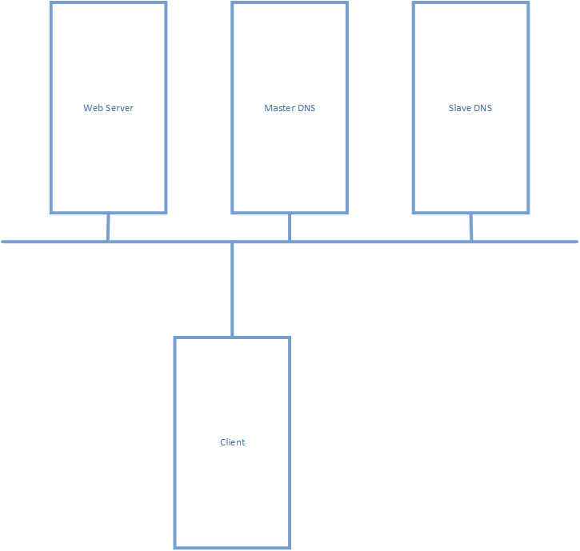
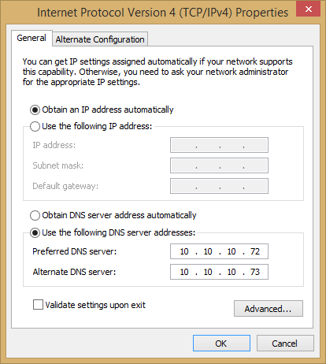
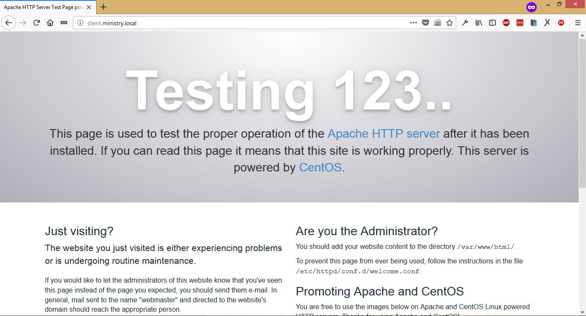

# 2. Cài đặt và cấu hình thử nghiệm DNS

____

# Mục lục

- [2.1 Cài đặt DNS](#install)
- [2.2 Cấu hình thử nghiệm DNS](#config)
    - [2.2.1 Cấu hình chung](#named)
    - [2.2.2 Tạo các zone files](#zonefiles)
    - [2.2.3 Khởi động DNS Service](#start)
    - [2.2.4 Kiểm tra kết quả cấu hình DNS](#check)
- [2.3 Xác định máy chủ thực hiện phân giải tên miền](#dig)
- [Các nội dung khác](#content-others)

____

# <a name="content">Nội dung</a>

> Nội dung thực hiện sử dụng: CentOS 7

- ### <a name="install">2.1 Cài đặt DNS</a>

    - Để cài đặt DNS, ta thực hiện sử dụng câu lệnh sau:

            yum install -y bind-utils bind

- ### <a name="config">2.2 Cấu hình thử nghiệm DNS</a>

    - Mô hình thử nghiệm DNS như sau:
        
        > 

        - Trong đó:

                | Hostname | IP Address | OS |
                | ------------- | ------------- | ------------- |
                | Master DNS | 10.10.10.72 | CentOS |
                | Slave DNS | 10.10.10.73 | CentOS |
                | Web Server | 10.10.10.20 | CentOS |
                | Client | any | Windows |
                
    - ### <a name="named">2.2.1 Cấu hình chung</a>
        - Các cấu hình có liên quan đến DNS, được cấu hình chủ yếu thông qua file `/etc/named.conf`.
        - Ta sẽ thực hiện cấu hình áp dụng cho file này như sau:
            + Cấu hình public DNS Service trên bất kỳ Network Interfaces
            + Cấu hình thiết lập máy chủ nội bộ
            + Cấu hình thiết lập DNS Slave (DNS Cluster)
            + Cấu hình liên kết zone files

        - Cụ thể các bước thực hiện như sau:
            > Các bước dưới đây thực hiện trên `Master DNS`

            - Cấu hình public DNS Service trên bất kỳ Network Interfaces:

                    vi /etc/named.conf

                trong block options, ta tìm đến `listen-on port 53 { 127.0.0.1; };` và sửa lại thành:

                    listen-on port 53 { any; };

            - Cấu hình thiết lập máy chủ nội bộ:

                    vi /etc/named.conf

                trong block options, ta tìm đến `allow-query  { localhost; };` và sửa lại thành:

                    allow-query  { localhost; 10.10.10.0/24; };

                trong đó: `10.10.10.0/24` là một dải mạng.

            - Cấu hình thiết lập DNS Slave (DNS Cluster):

                    vi /etc/named.conf

                trong block options, ta thêm vào một nội dung sau:

                    allow-transfer{ localhost; 10.10.10.73; };

                trong đó: `10.10.10.73` là địa chỉ IP của `Slave DNS`.

            - Cấu hình liên kết zone files:
                Việc cấu hình này nhắm mục đích tạo ra liên kết tới một zone để khai báo cho các tên miền cho phép DNS Server phân giải tên miền từ các địa chỉ IP

                    vi /etc/named.conf

                sau đó thêm nội dung sau ở bên ngoài block options:

                        zone "ministry.local" IN {
                            type master;
                                file "forward.ministry";
                                allow-update { none; };
                        };
                        zone "10.10.10.in-addr.arpa" IN {
                            type master;
                            file "reverse.ministry";
                            allow-update { none; };
                        };

                như vậy, ta đã thực hiện thêm liên kết tới 2 zone files là : `forward.ministry` và `reverse.ministry`. `10.10.10.in-addr.arpa` là phần viết ngược lại của dải mạng. Ví dụ: `172.16.0.80/29` => `80.0.16.172.in-addr.arpa`. Ngụ ý là quy định các địa chỉ thuộc dải mạng này.

    - ### <a name="zonefiles">2.2.2 Tạo các zone files</a>
        - Các zone file được lưu trữ mặc định trong `/var/named`
        - Trong bước này, ta sẽ thực hiện tạo ra `forward` và `reverse` zone files đã khai báo ở bước trên.

                vi /var/named/forward.ministry

            sau đó thêm nội dung như sau:

                $TTL 86400
                @   IN  SOA     masterdns.ministry.local. root.ministry.local. (
                        2011071001  ;Serial
                        3600        ;Refresh
                        1800        ;Retry
                        604800      ;Expire
                        86400       ;Minimum TTL
                )
                @       IN  NS          masterdns.ministry.local.
                @       IN  NS          slavedns.ministry.local.
                @       IN  A           10.10.10.72
                @       IN  A           10.10.10.73
                @       IN  A           10.10.10.20
                masterdns       IN  A   10.10.10.72
                slavedns    IN  A   10.10.10.73
                client          IN  A   10.10.10.20

            tiếp theo, ta sẽ tạo ra `reverse.ministry`:

                vi /var/named/reverse.ministry

            sau đó thêm nội dung như sau:

                $TTL 86400
                @   IN  SOA     masterdns.ministry.local. root.ministry.local. (
                        2011071001  ;Serial
                        3600        ;Refresh
                        1800        ;Retry
                        604800      ;Expire
                        86400       ;Minimum TTL
                )
                @       IN  NS          masterdns.ministry.local.
                @       IN  NS          slavedns.ministry.local.
                @       IN  PTR         ministry.local.
                masterdns       IN  A   10.10.10.72
                slavedns    IN  A   10.10.10.73
                client          IN  A   10.10.10.20
                72     IN  PTR         masterdns.ministry.local.
                73     IN  PTR         slavedns.ministry.local.
                20     IN  PTR         client.ministry.local.
    
    - Ta làm tương tự các bước như trên đối với `Slave DNS` như sau:
        - Cấu hình public DNS Service trên bất kỳ Network Interfaces:

                vi /etc/named.conf

            trong block options, ta tìm đến `listen-on port 53 { 127.0.0.1; };` và sửa lại thành:

                listen-on port 53 { any; };

        - Cấu hình thiết lập máy chủ nội bộ:

                vi /etc/named.conf

            trong block options, ta tìm đến `allow-query  { localhost; };` và sửa lại thành:

                allow-query  { localhost; 10.10.10.0/24; };

            trong đó: `10.10.10.0/24` là một dải mạng.

        - Cấu hình liên kết đối với `Master DNS`:

                vi /etc/named.conf
    
            sau đó, thêm nội dung sau nằm ngoài block options:

                zone "ministry.local" IN {
                    type slave;
                    file "slaves/ministry.fwd";
                    masters { 10.10.10.72; };
                };
                zone "1.168.192.in-addr.arpa" IN {
                    type slave;
                    file "slaves/ministry.rev";
                    masters { 10.10.10.72; };
                };

    - ### <a name="start">2.2.3 Khởi động DNS Service</a>

        - Để khởi động `DNS Service`, ta thực hiện sử dụng câu lệnh sau:

                systemctl enable named && systemctl start named

        - Public port DNS:

                firewall-cmd --add-service=dns --permanent
                firewall-cmd --reload

    - ### <a name="check">2.2.4 Kiểm tra kết quả cấu hình DNS</a>
        - Để thực hiện kiểm tra kết quả, tại máy chủ có địa chỉ IP là `10.10.10.20`. Ta thực hiện cài đặt `Web Server` để dễ dàng kiểm tra. Thực hiện sử dụng câu lệnh sau:

                yum install -y httpd

            sau đó khởi động dịch vụ:

                yum start httpd

        - Tại máy client, thực hiện cấu hình trỏ DNS tại phần cấu hình `Control Panel\Network and Internet\Network Connections` trong `Control Panel` như sau:

            > 

            lưu lại cấu hình, sau đó tại trình duyệt web của client, ta thực hiện truy cập tới địa chỉ `client.ministry.local` thu được kết quả tương tự như sau:

            > 
                
- ### <a name="dig">2.3 Xác định máy chủ thực hiện phân giải tên miền</a>
    - Để thực hiện xác định máy chủ thực hiện phân giải tên miền, ta có thể sử dụng câu lệnh sau:

            dig domain

        trong đó `domain` là một tên miền. Ví dụ:

            dig client.ministry.local

        kết quả nhận được như sau:

            ; <<>> DiG 9.9.4-RedHat-9.9.4-51.el7_4.2 <<>> client.ministry.local
            ;; global options: +cmd
            ;; Got answer:
            ;; ->>HEADER<<- opcode: QUERY, status: NOERROR, id: 41466
            ;; flags: qr aa rd ra; QUERY: 1, ANSWER: 1, AUTHORITY: 2, ADDITIONAL: 3

            ;; OPT PSEUDOSECTION:
            ; EDNS: version: 0, flags:; udp: 4096
            ;; QUESTION SECTION:
            ;client.ministry.local.         IN      A

            ;; ANSWER SECTION:
            client.ministry.local.  86400   IN      A       10.10.10.20

            ;; AUTHORITY SECTION:
            ministry.local.         86400   IN      NS      masterdns.ministry.local.
            ministry.local.         86400   IN      NS      slavedns.ministry.local.

            ;; ADDITIONAL SECTION:
            masterdns.ministry.local. 86400 IN      A       10.10.10.72
            slavedns.ministry.local. 86400  IN      A       10.10.10.73

            ;; Query time: 1 msec
            ;; SERVER: 10.10.10.72#53(10.10.10.72)
            ;; WHEN: Thu Mar 01 09:12:14 EST 2018
            ;; MSG SIZE  rcvd: 145

        với kết quả trên, ta có thể thấy được DNS nào thực hiện phân giải tên miền trong phần `;; ADDITIONAL SECTION:`
____

# <a name="content-others">Các nội dung khác</a>
